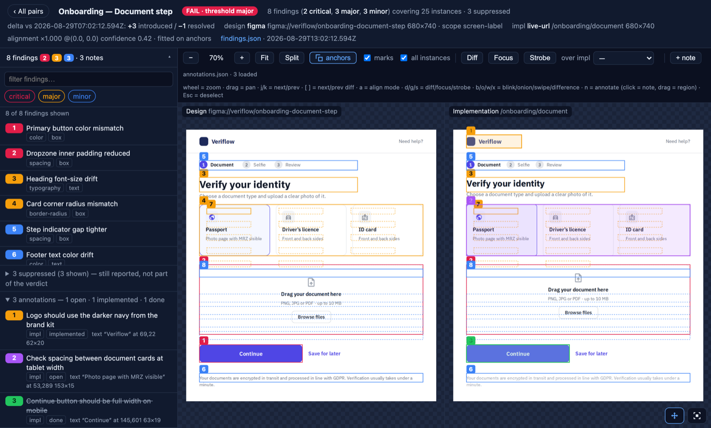
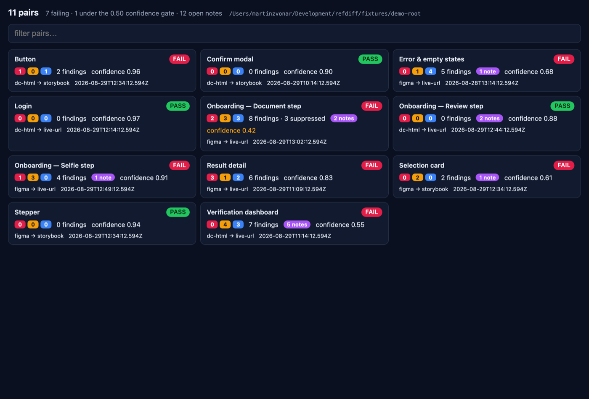
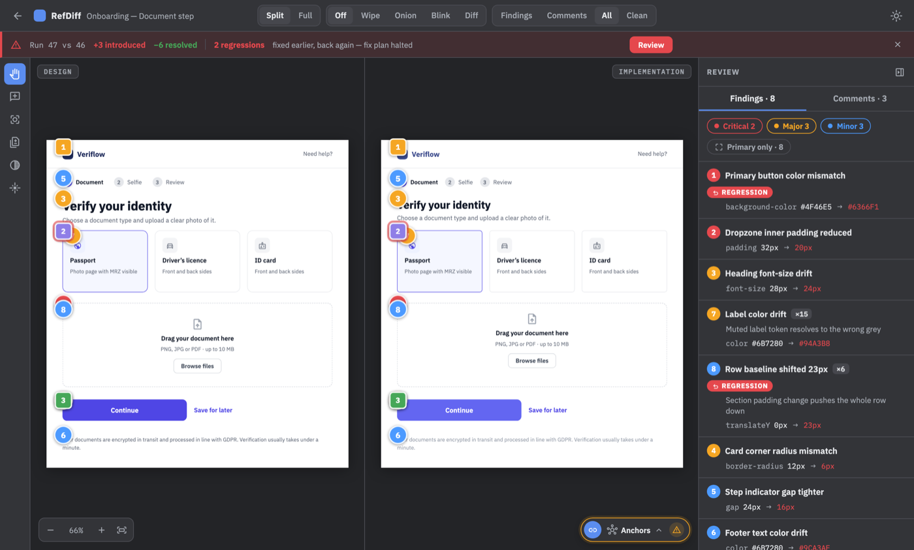
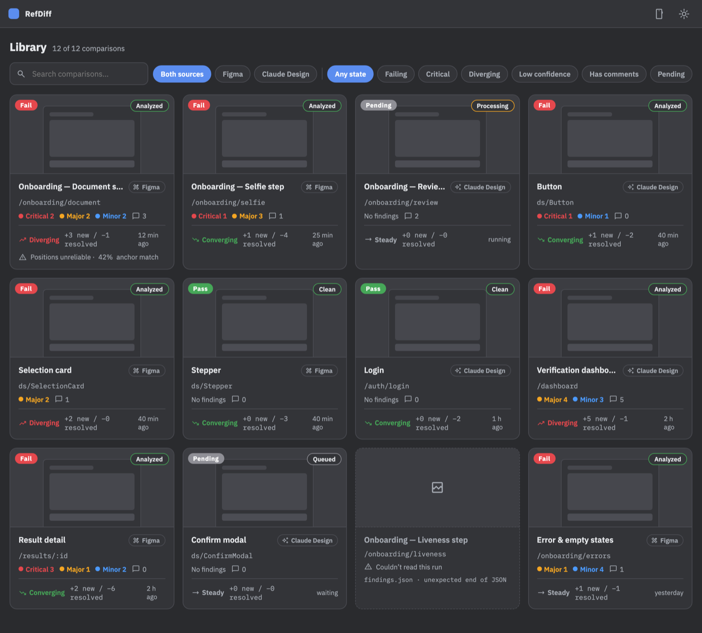
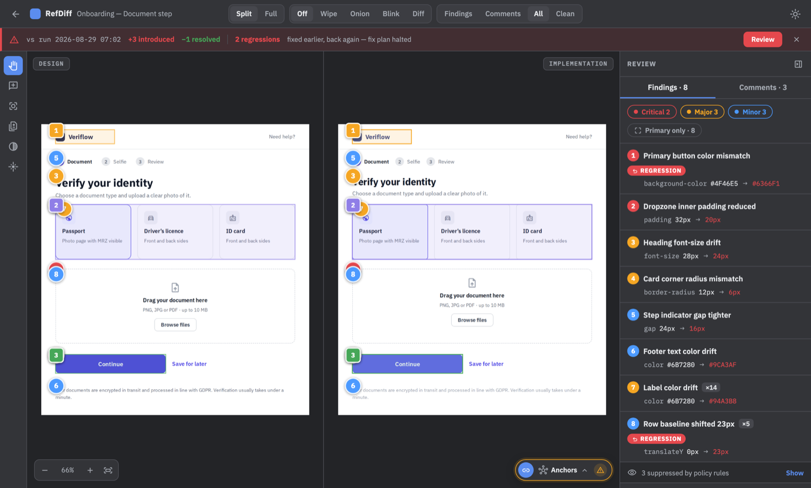
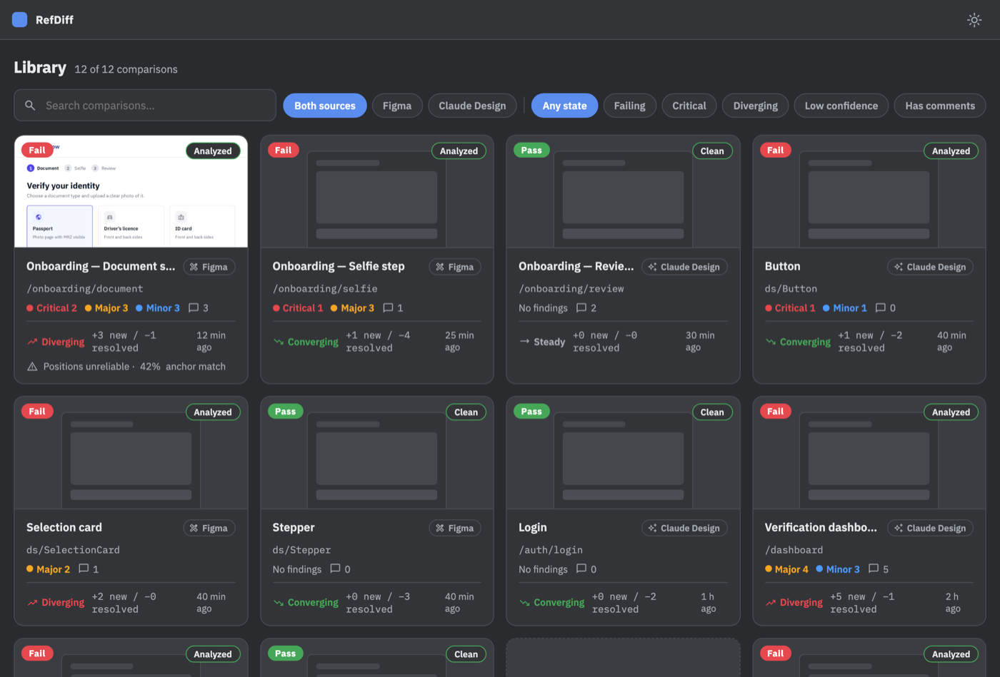

# Redesigning the annotator with its own method

refdiff's review app was built by a model that had never seen a design. Then
we drew one and pointed the tool at itself: the annotator serving a fixed
demo dataset became the *implementation under test*, the comps became the
*design*, and every claim of progress had to be a number out of
`refdiff summary`.

**The headline is not how it looks. It is that it ran on its own.**

Under the old method, every iteration needed a human in it. The model would
report "this matches now", a person would look, see that it plainly did not,
and say what was wrong — over and over, one hand-held correction per round.
The steering *was* the method; the tool only supplied the pictures.

Here, seven phases took the annotator from 1,398 findings to 37, and the
loop closed itself. Nobody looked at a screenshot and said "the header is
still too tall". The model read `findings.json`, changed the CSS, re-ran the
comparison, and read the delta — and when a phase's numbers stopped moving,
it was done. Human input entered in exactly two places, both by design:

- **before the loop** — the scope decisions (build every affordance for real,
  self-host the fonts, build a matching fixture dataset);
- **on design gaps** — questions the tool is explicitly built to escalate,
  because they are not measurable: features the comps never drew, and demo
  data the comps and the app genuinely disagree about.

Never on whether the implementation matched. That question stopped being
something a person had to answer.

The method itself — and why the model is never the one comparing — is in
[**The method: why the model is not allowed to
compare**](method.md).

Full log with every phase and its numbers:
[`plan-annotator-redesign.md`](plan-annotator-redesign.md).

---

## 1. Before

The annotator as it stood on 2026-08-28. Everything works. Nothing was
designed — the layout is whatever came out of describing features to a model
in prose, across a handful of sessions.

Three lines of metadata stacked above the fold. Sixteen controls in one flat
strip. The pair index is a wall of debug output with an absolute filesystem
path as a subtitle. It is a tool that reads like a log file, because prose
instructions produce whatever the model already had lying around.

## 2. The design

Four comps drawn in Claude Design (`design/refdiff/`), fetched into the repo
as `.dc.html`.

Same information, restructured: a topbar of mode segments, a delta strip that
states the run-over-run change, the canvas as the centre of gravity, a 320px
review rail with findings and comments as tabs, and a Library of cards with a
thumbnail, a trend and a state.

## 3. Setting up the measurement

The interesting part is what happened when we first pointed the tool at the
comps.

**Baseline, 2026-08-28, before touching anything:**

| pair | findings (crit/major/minor) | instances | confidence |
| --- | --- | --- | --- |
| refdiff-library-desktop | 272 (98/127/47) | 310 | **0.00** |
| refdiff-compare-desktop | 788 (111/618/59) | 834 | **0.00** |
| refdiff-library-mobile | 230 (59/109/62) | 332 | **0.00** |
| refdiff-compare-mobile | 108 (56/33/19) | 108 | **0.00** |

1,398 findings — and **confidence 0.00 on all four pairs**, which makes the
1,398 worthless. Confidence measures how well the alignment fit explains the
pieces of unique text found on both sides, damped when there are fewer than
eight of them. The app was showing its own real run directories while the comp
showed the designer's invented demo data, so the two sides shared almost no
text at all. With no anchors there is no trustworthy alignment, and with no
alignment every `position` and `size` finding is noise.

This is the method catching its own misuse. A naive harness would have
happily produced a 1,398-item report and let the model start "fixing" things.

So phase 0 was not design work at all: build
[`fixtures/demo-root/`](../fixtures) — a committed fixture dataset whose runs
mirror the comps' demo data exactly, twelve items with the same names,
severities, comment counts and findings the comps draw. Give both sides the
same content, and the geometry becomes measurable.

The honest baseline against the fixture: **1,227 findings, still confidence
0.00** (the typography was still `system-ui` against IBM Plex, so even shared
strings did not match as anchors).

## 4. The loop, phase by phase

Rules, enforced for every phase:

1. Measure at the start and the end. A phase is done when its numbers moved.
2. Never edit a comp to make a finding go away. If the comp is wrong or
   silent, it is a question for the designer.
3. Intended deviations are `accepted` with the measurement as the reason —
   never a silent filter.
4. A regression stops the phase.

| phase | what | findings after (lib-desktop / compare-desktop / lib-mobile / compare-mobile) | confidence |
| --- | --- | --- | --- |
| 0 | demo fixture + honest baseline | 405 / 361 / 343 / 118 | 0.00 all |
| 1 | tokens, theme, self-hosted IBM Plex + icon subset | 390 / 339 / 323 / 116 | 0.08 / 0.13 / 0.00 / 0.25 |
| 2 | Library route rebuilt to the comp | **9** / 339 / **5** / 116 | 0.90 / – / 1.00 / – |
| 3 | comparison chrome, tool strip, canvas overlays | 9 / **217** / 5 / **34** | – / 0.38 / – / 0.52 |
| 4 | review rail — Findings and Comments | 9 / **51** / 5 / **4** | – / 0.71 / – / 0.90 |
| 5 | convergence + accepted deviations | 9 / 50 / 5 / 3 | 0.90 / 0.71 / 1.00 / 0.90 |
| 7 | phone minimal layout, settings popover | **2** / **32** / **0** / 3 | 0.89 / 0.72 / 1.00 / 0.91 |

1,398 → 37 findings across four pairs, and the alignment fit is the identity
(`scale 1, offset 0,0`) on every one of them.

Note phase 2 and phase 3 in the same rows: rebuilding the Library moved the
Library pairs by two orders of magnitude and left the comparison pairs
untouched, and vice versa. That separation is only visible because the tool
localises findings; a prose report would have blurred it into "looking better".

## 5. After

Held side by side with §2, these are the same page. The 32 findings that
remain on the comparison pair are almost entirely the comp's demo data
arguing with the fixture's: the comp lists its finding rows in the order
`1,2,3,7,8,4,5,6` where refdiff lists `1..8`, and its two aggregate rows carry
an extra "cause" line that pushes everything below them down. The mis-paired
digits and row offsets those two cause are 30 of the 32. Each survivor is
named, with its cause, in the plan's phase 5.

## 6. What only the measurement found

Three bugs that no amount of looking would have produced, and that a model
comparing screenshots would have rated a perfect match:

**The comps are content-box; the app was border-box.** `support.js` ships no
`box-sizing` reset, and the comps put fixed sizes inline on bordered divs — so
the comp's phone sheet is `height: 44` **plus** a 1px border = 45px. Ours was
44, and the whole sheet sat 1px low. The same shape appeared in eleven places:
topbar, delta strip, tool strip, rail, align menu, Library topbar, search
field, error card. Every rule now reads as the comp's number plus its border,
`calc(320px + 1px)`.

**A 3px transparent left edge on the wrong rows.** The comp's comment rows
carry `border-left: 3px solid transparent`; its finding rows do not. Ours had
it on both, so every finding row's contents sat 3px right of the comp's.
Measured, not inferred: the rail badges were at x=1062.5 against the comp's
1058.5.

**One inherited `line-height`.** The Design/Impl toggle inherited the report's
`line-height: 1.4` where the comp's button has none — 18.2px per line against
17px, a 1.2px-tall control difference on the phone.

Each of these is under the [DiffSpot](https://arxiv.org/abs/2605.29615) floor
by a wide margin: 4% median recall on `line-height`, and a 1px box difference
does not survive the model's image downscaling at all.

The best evidence is indirect. Before these fixes, the **alignment fit was
absorbing them**: the desktop pair fitted at `scale 1.00175, offset
(−0.54, −1.98)`, the mobile at `scaleY 1.00067`. A systematic 1–2px error was
being quietly cancelled by the registration step, so no finding ever showed
it. Only after the content-box fix did all pairs read `scale 1, offset 0,0` —
which is the state in which the *next* 1px regression becomes visible.

## 7. What the measurement could not decide

The tool is explicit about its own limits, and those became a list of
questions for the designer rather than guesses:

- **Features the comps never drew** — the diff lab's blend modes, the four
  alignment modes, the focus region, triage verdicts. The phase that needed
  one stopped and asked instead of inventing a control.
- **Demo-data disagreements** — the comp's `Pending` state chip for a state
  refdiff does not have; its `×15` where refdiff counts 14 distinct places
  (the comp's demo array repeats the primary rect); its `Run 47 vs 46` copy.
  Each is excused by a rule that names the *text*, so the rule expires when
  the comp changes.
- **States nobody measured, by decision** — light theme, error states,
  unfolded menus. Not claimed as verified; recorded as unmeasured.

Every excused finding still appears in `findings.json` under `suppressed`,
tagged with the rule that hit it — 91 of them on the two desktop pairs. A
wrong policy stays auditable.

## 8. What this cost, and what it is worth

Seven phases over two days, unattended. The parts that took the time were not
the CSS: building a fixture dataset that gives the two sides shared anchors
(phase 0), and running the convergence loop far enough that every remaining
finding could be named and justified (phase 5).

What came out of it is a UI that is *checked* rather than *believed*. The
protected baseline — 2 / 32 / 0 / 3 / 10 findings across five pairs, with the
alignment at the identity on all of them — is recorded in
[`refdiff.bindings.md`](../refdiff.bindings.md). Any future change to the
annotator that drifts from the comps moves those numbers in one command, and
the regression ledger names what came back.

That is the whole claim of the method. Not that the tool made the app
prettier — that "it matches the design" stopped being an opinion, and
therefore stopped needing a person to supply it.
